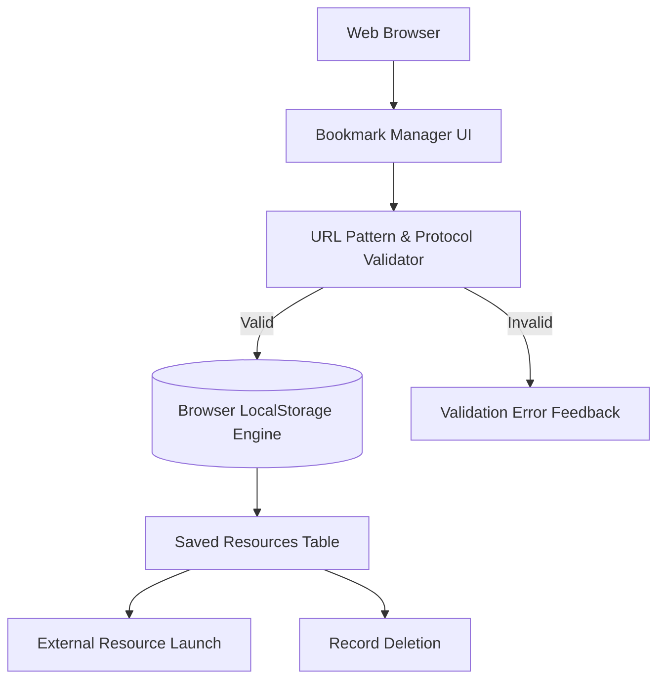

# Bookmark Manager: Web Resource Bookmarking Utility

Responsive client-side web application for organizing, validating, and managing frequently accessed web resources with browser local persistence.



## Features

- **Protocol Validation**: Enforces valid URL patterns (`http://`, `https://`) before storing links.
- **Client Persistence**: Uses browser LocalStorage to maintain bookmark collections across sessions.
- **Responsive Table**: Mobile-friendly presentation of site names, URLs, and action controls.

## Technology Stack

- **Markup**: HTML5
- **Styling**: Custom CSS3 & Bootstrap
- **Scripting**: Vanilla JavaScript (ES6)

## Local Execution

Open `index.html` directly in any web browser, or serve locally:

```bash
npx serve .
```
